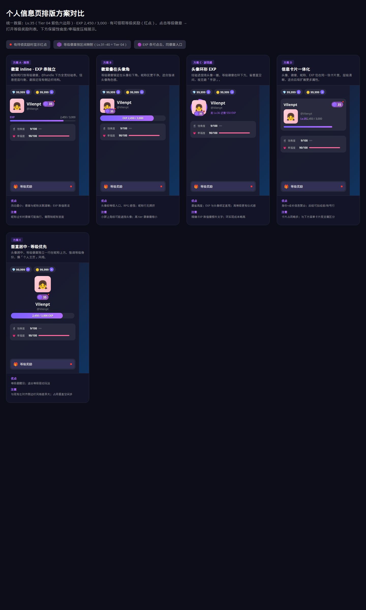
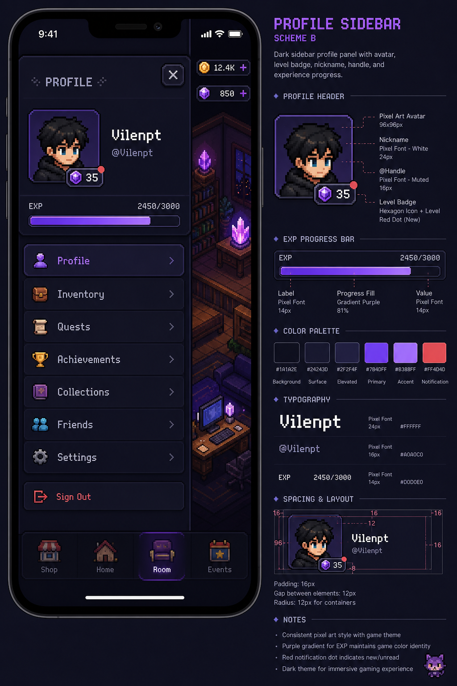
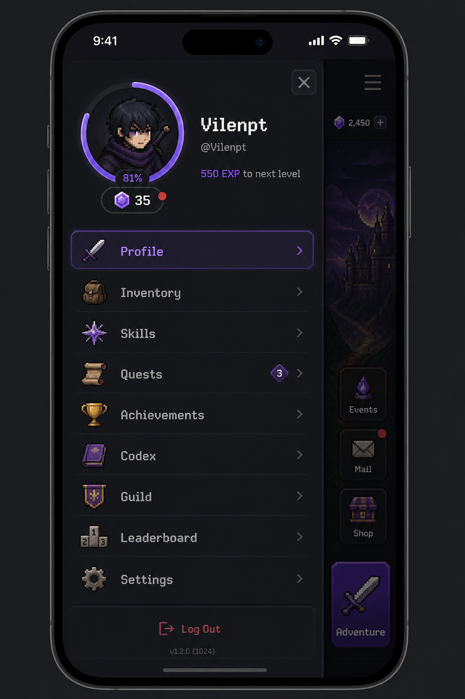

# 个人信息页排版方案对比

> 统一演示数据：Lv.35（Tier 04 紫色六边形）· EXP 2,450 / 3,000 · 有可领取奖励（红点）

## 对比总览



**可交互预览：** 浏览器打开 [`prototype/layout-comparison.html`](../prototype/layout-comparison.html)

---

## 方案 A · 徽章 inline · EXP 条独立（推荐）

```
[头像]  昵称  [Lv徽章●]
        @handle
━━━━━━━━ EXP ━━━━━━━━  2,450/3,000
```

| 维度 | 说明 |
|------|------|
| 等级徽章位置 | 昵称同一行右侧 |
| 经验条位置 | 身份区下方，全宽细条 |
| 点击入口 | 徽章 / EXP 条 / 菜单「等级奖励」 |
| 优点 | 改动最小，与现有侧边栏结构最接近；数值易读 |
| 注意 | 昵称过长时徽章可能换行，需 `max-width` + 省略 |

**适用场景：** 希望平滑迭代、不大幅改变现有信息层级。

---

## 方案 B · 徽章叠在头像角

```
[头像]       昵称
 [徽章●]     @handle
━━━━━━━━ EXP 2,450/3,000 ━━━━━━━━
```

| 维度 | 说明 |
|------|------|
| 等级徽章位置 | 头像右下角 overlay |
| 经验条位置 | 胶囊形内嵌文字进度条 |
| 点击入口 | 头像角徽章（主）/ EXP 条 / 菜单 |
| 优点 | 头像即等级入口，RPG 角色感强；昵称行更干净 |
| 注意 | 高 tier 徽章（带翼/花环）需缩小；可能遮挡头像 |



**适用场景：** 强调「角色」而非「账号」，偏游戏角色面板。

---

## 方案 C · 头像环形 EXP（游戏感最强）

```
  ╭─EXP环─╮
  │ 头像  │   昵称
  ╰─[徽章●]   @handle
              距 Lv.36 还需 550 EXP
```

| 维度 | 说明 |
|------|------|
| 等级徽章位置 | 环下方居中 |
| 经验条位置 | 头像外圈 SVG/CSS 环形进度 |
| 点击入口 | 环 / 徽章 / 菜单 |
| 优点 | 最省垂直空间；EXP 与角色绑定直观；高等级仪式感 |
| 注意 | 精确 EXP 需额外文字；实现成本高于方案 A/B |



**适用场景：** 等级是核心玩法驱动，愿意投入更多 UI 实现。

---

## 方案 D · 信息卡片一体化

```
┌─────────────────────────┐
│ 昵称            [徽章●] │
│ [头像]  @handle         │
│         Lv.35  2450/3000│
│ ████████░░░░░░░░░░░░░░░ │
└─────────────────────────┘
```

| 维度 | 说明 |
|------|------|
| 等级徽章位置 | 卡片右上角 |
| 经验条位置 | 卡片底部 |
| 点击入口 | 徽章 / 卡片内 EXP 条 / 菜单 |
| 优点 | 身份+成长聚合；后续可扩展称号、成就行 |
| 注意 | 多一层卡片背景；与下方菜单组需视觉区分 |

**适用场景：** 计划在个人信息区继续加属性（称号、VIP、公会等）。

---

## 方案 E · 垂直居中 · 等级优先

```
      [头像]
    [徽章● Lv.35]
      昵称
     @handle
  ━━━ EXP 2450/3000 ━━━
```

| 维度 | 说明 |
|------|------|
| 等级徽章位置 | 头像下方独立一行 |
| 经验条位置 | 居中胶囊条 |
| 点击入口 | 徽章 / EXP 条 / 菜单 |
| 优点 | 等级最醒目；个人主页/身份卡感 |
| 注意 | 与现有左对齐侧边栏差异大；占垂直空间多 |

**适用场景：** 等级展示优先级高于效率，或独立「个人主页」场景。

---

## 决策建议

| 优先级 | 推荐 |
|--------|------|
| 最小改动、快速上线 | **方案 A** |
| 强化角色感、头像做文章 | **方案 B** 或 **方案 C** |
| 后续扩展更多信息 | **方案 D** |
| 等级为核心卖点 | **方案 E** 或 **方案 C** |

### 共同规则（所有方案一致）

- 等级图标按 **10 档区间**映射（Lv.1–10 → Tier 01 … Lv.91+ → Tier 10）
- 徽章内显示 **当前实际等级数字**（如 35）
- 有待领奖励 → 徽章 **红点** + 菜单「等级奖励」**红点**
- 点击等级徽章 → 打开 **等级奖励列表面板**（见 [`profile-reward-panel-mockup.png`](../mockups/profile-reward-panel-mockup.png)）

---

## 下一步

1. 确认选用方案（或 A/B 混搭，如 A 的徽章位置 + C 的环形 EXP）
2. 定稿后更新 [`profile-level-redesign.md`](profile-level-redesign.md) 主规格
3. 输出最终高保真方案图 + 切图清单
